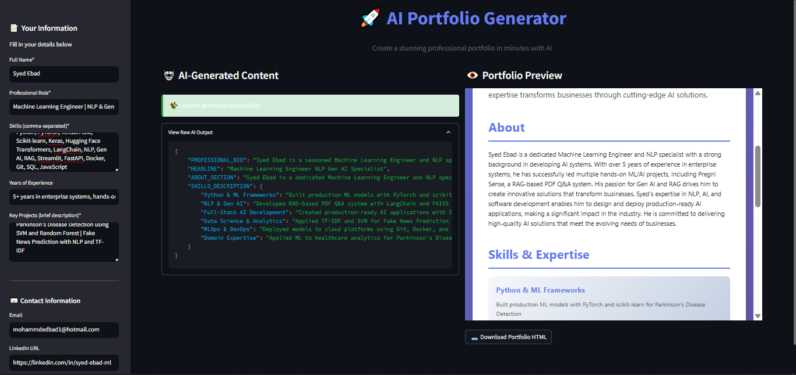
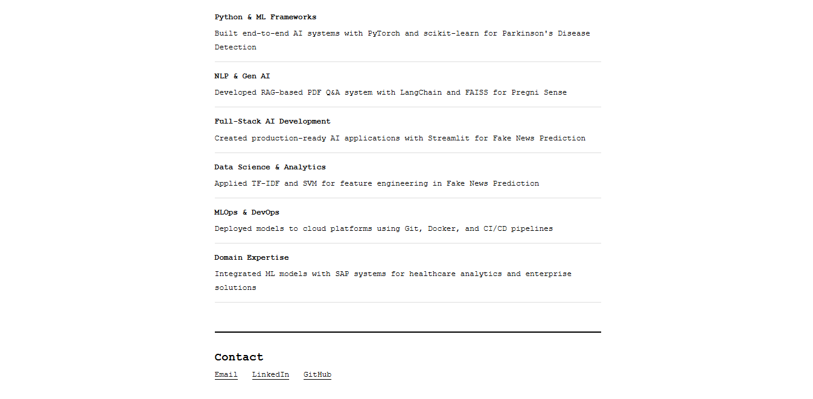

# 🚀 AI Portfolio Generator

[](https://www.python.org/downloads/)
[](https://streamlit.io)
[](https://groq.com)
[](LICENSE)

> Generate professional portfolio in seconds using AI. Built with Streamlit and powered by Groq's free Llama 3.3-70B model.

---

## 📸 Final Outcome of the App

### 🖥️ Streamlit Application Interface



### 🎨 Generated Portfolio – Hero & About Section


### 💡 Generated Portfolio – Skills & Contact Section




---

## ✨ Features

- 🤖 **AI-Powered Content Generation** - Automatically creates professional bios, headlines, and detailed skill descriptions
- 🎨 **Multiple Templates** - Choose from Modern Gradient or Minimalist Black & White designs
- 📱 **Fully Responsive** - Perfect display on desktop, tablet, and mobile devices
- ⚡ **Lightning Fast** - Complete portfolios generated in 2-3 seconds
- 💾 **One-Click Download** - Export as ready-to-deploy HTML files
- 🆓 **100% Free** - Uses Groq's free API (14,400 requests/day limit)
- 🎯 **No Design Skills Required** - AI handles all content creation

---

## 🎯 Demo

### Sample Input
```
Name: Syed Ebad
Role: Machine Learning Engineer
Skills: Python, PyTorch, TensorFlow, NLP, Gen AI, RAG, LangChain
Experience: 5+ years in enterprise systems with hands-on ML/AI projects
Projects: DocuChat (RAG-based PDF Q&A with LangChain & FAISS), Parkinson's Disease Detection (SVM/Random Forest classifier)
```

### Output
✨ Professional portfolio featuring:
- Compelling bio highlighting expertise and impact
- Eye-catching professional headline  
- Detailed skills descriptions with real-world context
- Responsive, modern design with smooth animations

🔗 **[View Live Demo](https://ai-portfolio-generator-smebad.streamlit.app/)**

---

## 🛠️ Tech Stack

| Technology | Purpose |
|------------|---------|
| **Python 3.8+** | Core programming language |
| **Streamlit** | Web framework and UI |
| **Groq API** | AI model inference (Llama 3.3-70B) |
| **Custom CSS** | Responsive design with gradient animations |
| **python-dotenv** | Environment variable management |

---

## 📋 Prerequisites

- Python 3.8 or higher
- pip (Python package manager)
- A free Groq API key ([Get one here](https://console.groq.com))

---

## 🚀 Installation & Setup

### 1️⃣ Clone the Repository

```bash
git clone https://github.com/smebad/AI-portfolio-generator.git
cd ai-portfolio-generator
```

### 2️⃣ Create Virtual Environment

**Windows:**
```bash
python -m venv venv
venv\Scripts\activate
```

**Mac/Linux:**
```bash
python3 -m venv venv
source venv/bin/activate
```

### 3️⃣ Install Dependencies

```bash
pip install -r requirements.txt
```

### 4️⃣ Set Up Environment Variables

```bash
# Copy the example file
cp .env.example .env
```

Edit `.env` and add your Groq API key:

```env
GROQ_API_KEY=your_actual_groq_api_key_here
```

**How to get your free Groq API key:**

1. Visit [console.groq.com](https://console.groq.com)
2. Sign up (no credit card required)
3. Navigate to **"API Keys"**
4. Click **"Create API Key"**
5. Copy and paste into your `.env` file

### 5️⃣ Run the Application

```bash
streamlit run app.py
```

---

## 📖 Usage Guide

### Step 1: Enter Your Information

Fill in the sidebar form with:
- **Full Name** - Your professional name
- **Professional Role** - Job title (e.g., "Machine Learning Engineer")
- **Skills** - Comma-separated list (e.g., "Python, PyTorch, NLP, Gen AI")
- **Experience** - Years of experience (e.g., "5+ years")
- **Key Projects** - Brief descriptions of your notable projects
- **Contact Info** - Email, LinkedIn, and GitHub URLs

### Step 2: Choose a Template

**🎨 Modern Gradient**
- Vibrant purple gradient header
- Animated hover effects on skill cards
- Perfect for creative professionals and tech roles
- Eye-catching and modern aesthetic

**⬛ Minimalist Black & White**
- Clean monospace typography
- Professional black & white design
- Timeless and elegant appearance
- Ideal for traditional industries

### Step 3: Generate Your Portfolio

Click **"✨ Generate Portfolio"** and watch AI create your content in real-time!

The AI will:
- Craft a compelling 2-3 sentence bio
- Generate a catchy professional headline
- Create detailed skill descriptions with context
- Structure everything professionally

### Step 4: Download & Deploy

1. Preview your portfolio in the right panel
2. Click **"📥 Download Portfolio HTML"**
3. Upload to your hosting platform:
   - **GitHub Pages** (free)
   - **Netlify** (free)
   - **Vercel** (free)
   - **Your own web hosting**

---

## 📁 Project Structure

```
AI-portfolio-generator/
│
├── app.py                          # Main Streamlit application
├── requirements.txt                # Python dependencies
├── .env.example                    # Environment variables template
├── .gitignore                      # Git ignore rules
├── README.md                       # Project documentation
├── assets/
│   ├── streamlit-UI-1.png
│   ├── portfolio-img-1-bw.png
│   ├── portfolio-img-1.png
│   ├── portfolio-img-2-bw.png
│   ├── portfolio-img-2.png
│   
└── utils/
    ├── __init__.py                # Package initializer
    ├── ai_helper.py               # Groq API integration
    └── portfolio_templates.py     # HTML template generators
```

---

## 🎨 Template Showcase

### Modern Gradient Template

**Features:**
- CSS gradient animations with fade-in effects
- Responsive grid layout for skill cards
- Smooth hover transitions
- Mobile-optimized design
- Professional purple color scheme

**Best for:** Creative professionals, designers, developers, modern tech roles

### Minimalist Black & White Template

**Features:**
- Clean monospace typography (Courier New)
- Classic black & white aesthetic
- List-based skill presentation
- Border-based visual hierarchy
- Timeless, professional look

**Best for:** Developers, academics, consultants, traditional industries

---

## 🔧 Configuration

### Changing AI Models

Edit `utils/ai_helper.py` to use different Groq models:

```python
self.model = "llama-3.3-70b-versatile"  # Default (best quality)

# Alternatives:
# self.model = "mixtral-8x7b-32768"      # Good alternative
# self.model = "llama-3.1-8b-instant"    # Faster, less accurate
```

### Customizing Templates

Add your own template in `utils/portfolio_templates.py`:

```python
def get_custom_template(data):
    """Your custom HTML template"""
    html = f"""
    <!DOCTYPE html>
    <html>
    <!-- Your custom HTML here -->
    </html>
    """
    return html

# Add to TEMPLATES dictionary
TEMPLATES["Custom Name"] = get_custom_template
```

---

## 🤝 Contributing

Contributions are welcome! Here's how you can help:

1. **Fork the repository**
2. **Create a feature branch**
   ```bash
   git checkout -b feature/AmazingFeature
   ```
3. **Commit your changes**
   ```bash
   git commit -m 'Add some AmazingFeature'
   ```
4. **Push to the branch**
   ```bash
   git push origin feature/AmazingFeature
   ```
5. **Open a Pull Request**

### Ideas for Contributions

- 🎨 Add new portfolio templates
- 🌍 Add multi-language support
- 📄 Add PDF export functionality
- 🎨 Custom color scheme picker
- 🖼️ Project gallery with image upload
- 🔗 GitHub integration to auto-fetch repositories
- 🔍 SEO optimization for generated HTML

---

## 🐛 Known Issues & Limitations

- **Rate Limits**: Groq free tier limited to 14,400 requests/day
- **Long Descriptions**: Skill descriptions over 100 words may overflow on mobile
- **Browser Compatibility**: Gradient text effects may not work on older browsers (fallback provided)

---

## 📝 Roadmap

Future enhancements planned:

- [ ] 🎨 Add 3+ new portfolio templates (Creative, Tech-focused, Business)
- [ ] 📄 PDF export functionality
- [ ] 🎨 Custom color scheme picker with live preview
- [ ] 🖼️ Project gallery with image upload support
- [ ] 🌍 Multi-language content generation (Spanish, French, German)
- [ ] 🔗 GitHub integration to auto-fetch repositories and stats
- [ ] 🔍 SEO optimization and meta tags for generated HTML
- [ ] 💾 Save/Load draft functionality
- [ ] 📊 Analytics dashboard for portfolio views
- [ ] 🎯 A/B testing for different portfolio versions
- [ ] 🔐 User authentication and portfolio management
- [ ] 📱 Mobile app version

---

## 📄 License

This project is licensed under the MIT License - see the [LICENSE](LICENSE) file for details.

```
MIT License

Copyright (c) 2026 Syed Muhammad Ebad

Permission is hereby granted, free of charge, to any person obtaining a copy
of this software and associated documentation files (the "Software"), to deal
in the Software without restriction, including without limitation the rights
to use, copy, modify, merge, publish, distribute, sublicense, and/or sell
copies of the Software, and to permit persons to whom the Software is
furnished to do so, subject to the following conditions:

The above copyright notice and this permission notice shall be included in all
copies or substantial portions of the Software.

THE SOFTWARE IS PROVIDED "AS IS", WITHOUT WARRANTY OF ANY KIND, EXPRESS OR
IMPLIED, INCLUDING BUT NOT LIMITED TO THE WARRANTIES OF MERCHANTABILITY,
FITNESS FOR A PARTICULAR PURPOSE AND NONINFRINGEMENT. IN NO EVENT SHALL THE
AUTHORS OR COPYRIGHT HOLDERS BE LIABLE FOR ANY CLAIM, DAMAGES OR OTHER
LIABILITY, WHETHER IN AN ACTION OF CONTRACT, TORT OR OTHERWISE, ARISING FROM,
OUT OF OR IN CONNECTION WITH THE SOFTWARE OR THE USE OR OTHER DEALINGS IN THE
SOFTWARE.
```

---

## 👤 Author

**Syed Muhammad Ebad**

- 💼 LinkedIn: [linkedin.com/in/syed-ebad-ml](https://linkedin.com/in/syed-ebad-ml)
- 🐙 GitHub: [@smebad](https://github.com/smebad)
- 📧 Email: mohammdedbad1@hotmail.com

---

## 💡 Inspiration

This project was built to solve a real problem: creating professional portfolios is time-consuming and often requires design skills many developers don't have. With AI, anyone can generate a beautiful, professional portfolio in seconds, allowing them to focus on what matters - showcasing their work and landing their dream job.

---

## 🌟 Show Your Support

If you found this project helpful:

- ⭐ **Star this repository**
- 🐛 **Report bugs** via [Issues](https://github.com/smebad/ai-portfolio-generator/issues)
- 💡 **Suggest features** via [Issues](https://github.com/smebad/ai-portfolio-generator/issues)
- 📢 **Share with others** who might find it useful

---

## 📞 Support & Contact

If you encounter any issues or have questions:

- 📬 **Open an issue**: [GitHub Issues](https://github.com/smebad/ai-portfolio-generator/issues)
- 📧 **Email me**: mohammdedbad1@hotmail.com
- 💼 **Connect on LinkedIn**: [Syed Ebad](https://linkedin.com/in/syed-ebad-ml)

---

## 🔖 Tags

`portfolio-generator` `ai` `machine-learning` `streamlit` `groq` `llama` `python` `web-development` `automation` `resume-builder` `career-tools` `nlp` `generative-ai`

---

<div align="center">

**Made with ❤️ by [Syed Ebad](https://github.com/smebad)**

[⬆ Back to Top](#-ai-portfolio-generator)

</div>
